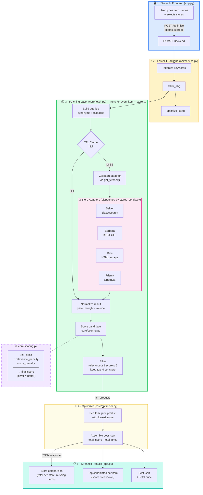

Here's the full application flow:

Summary of the architecture
1. Streamlit Frontend (app.py) — Users type generic item names via Quick Add, select which stores to search, and hit "Find best cart". The request is sent as a POST /optimize to the backend.

2. FastAPI Backend (api/service.py) — Receives {items, stores}, tokenizes keywords, then delegates to two core modules: fetch and optimize.

3. Fetching Layer (core/fetch.py) — For every item × store combination:

    - Builds multiple search queries (synonyms, token fallbacks)
    - Checks a TTL cache (core/cache.py) before calling external APIs
    - Normalizes raw results (price parsing, weight/volume extraction)
    - Scores and filters candidates (relevance ≥ 1, score ≤ 5), keeping top N per store

4. Store API Modules — Each store has its own adapter with a different integration method:

    * selver_api.py — Elasticsearch POST
    * barbora_api.py — REST GET
    * rimi_api.py — HTML scraping (BeautifulSoup)
    * prisma_api.py — GraphQL query
    
    Store dispatching is handled dynamically via stores_config.py (get_fetcher() does a runtime import).

5. Scoring (core/scoring.py) — Each candidate gets a composite score: unit_price + relevance_penalty + size_penalty (lower = better).

6. Optimizer (core/optimiser.py) — For each item, picks the product with the lowest score from valid stores → assembles the best cart.

7. Results display — Back in Streamlit: store comparison table, top candidates per item with score breakdowns, and the final best cart with total price.

# Application Architecture

