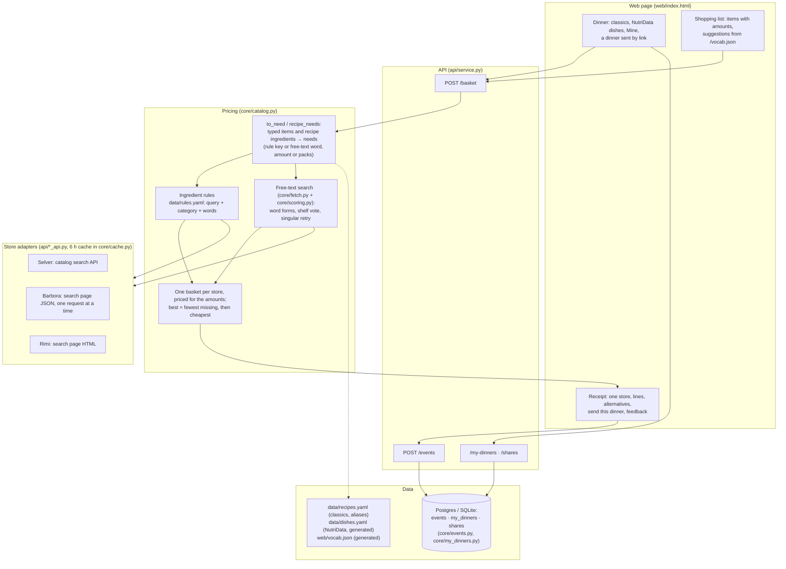

# pantryrun architecture

One FastAPI service serves the web page and the API. Prices come live from the store e-shops; there is no
product database. Our own data is the event log, people's dinners and shared links (Postgres, or SQLite locally).

```mermaid
flowchart TD
    subgraph WEB["Web page  (web/index.html)"]
        D["Dinner: classics, NutriData dishes, Mine,<br/>a dinner sent by link"]
        L["Shopping list: items with amounts,<br/>suggestions from /vocab.json"]
        R["Receipt: one store, lines, alternatives,<br/>send this dinner, feedback"]
    end

    subgraph API["API  (api/service.py)"]
        B["POST /basket"]
        M["/my-dinners · /shares"]
        E["POST /events"]
    end

    subgraph CORE["Pricing  (core/catalog.py)"]
        N["to_need / recipe_needs:<br/>typed items and recipe ingredients → needs<br/>(rule key or free-text word, amount or packs)"]
        RU["Ingredient rules<br/>data/rules.yaml: query + category + words"]
        FT["Free-text search  (core/fetch.py + core/scoring.py):<br/>word forms, shelf vote, singular retry"]
        BK["One basket per store, priced for the amounts;<br/>best = fewest missing, then cheapest"]
    end

    subgraph STORES["Store adapters  (api/*_api.py, 6 h cache in core/cache.py)"]
        S1["Selver: catalog search API"]
        S2["Barbora: search page JSON, one request at a time"]
        S3["Rimi: search page HTML"]
    end

    subgraph DATA["Data"]
        Y["data/recipes.yaml (classics, aliases)<br/>data/dishes.yaml (NutriData, generated)<br/>web/vocab.json (generated)"]
        DB[("Postgres / SQLite:<br/>events · my_dinners · shares<br/>(core/events.py, core/my_dinners.py)")]
    end

    D --> B
    L --> B
    B --> N --> RU --> STORES
    N --> FT --> STORES
    RU --> BK
    FT --> BK --> R
    D --> M --> DB
    R --> E --> DB
    N -.-> Y
```

Generated data and checks:
- `scripts/import_nutridata.py` → `data/dishes.yaml` (re-run rarely).
- `scripts/build_vocab.py` → `web/vocab.json` (every month or two).
- `scripts/healthcheck.py`: daily on GitHub Actions; opens an issue when a store or ingredient rule breaks.
- `scripts/rules_preview.py`: what each ingredient rule picks, to write or fix `data/rules.yaml`.
