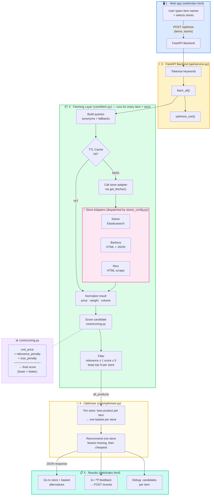

Here's the full application flow:

Summary of the architecture
1. Web app (web/index.html, served by the API at /) — A single plain HTML/CSS/JS page with two missions: "Dinner tonight" (pick a recipe → POST /dinner) and "Shopping list" (type items → POST /optimize).

2. FastAPI Backend (api/service.py) — Receives {items, stores}, tokenizes keywords, then delegates to two core modules: fetch and optimize.

3. Fetching Layer (core/fetch.py) — For every item × store combination:

    - Runs item × store combinations concurrently (thread pool)
    - Builds multiple search queries (synonyms, token fallbacks)
    - Checks a TTL cache (core/cache.py) before calling external APIs
    - Normalizes raw results (price parsing, weight/volume extraction)
    - Scores and filters candidates (relevance ≥ 1, score ≤ 5), keeping top N per store

4. Store API Modules — Each store has its own adapter with a different integration method:

    * selver_api.py — Elasticsearch POST
    * barbora_api.py — search page HTML (embedded product JSON)
    * rimi_api.py — HTML scraping (BeautifulSoup)
    
    Store dispatching is handled dynamically via stores_config.py (get_fetcher() does a runtime import).

5. Scoring (core/scoring.py) — Each candidate gets a composite score: unit_price + relevance_penalty + size_penalty (lower = better).

6. Optimizer (core/optimiser.py) — Builds one basket per store (best-scored product per item), then recommends the single store with the fewest missing items, cheapest first. Other stores are returned as alternatives. Baskets are never split across stores.

7. Results display — Back in the web app: "Go to <store>" with the basket, alternatives, 👍/👎 feedback and a "something looks wrong?" report.

8. Dinner mission (core/catalog.py) — POST /dinner takes a recipe from data/recipes.yaml, finds acceptable products per ingredient at Selver and Rimi using data/rules.yaml (query + category + required/excluded words), prices the amount needed (whole packs, or weight × €/kg for loose goods) and recommends one store: fewest missing ingredients, then cheapest. scripts/healthcheck.py checks adapters and rules daily (GitHub Actions).

9. Events (core/events.py) — Every /optimize request and every 👍/👎 (POST /events) is appended to an events table (Postgres via DATABASE_URL, else SQLite). Testers are identified by a ?u=<id> link parameter.

# Application Architecture

```mermaid
flowchart TD

    %% ── STEP 1: UI ───────────────────────────────────────────
    subgraph UI["🖥️ 1 · Web app  (web/index.html)"]
        direction LR
        A["User types item names\n+ selects stores"] -->|"POST /optimize\n{items, stores}"| B["FastAPI Backend"]
    end

    %% ── STEP 2: API ──────────────────────────────────────────
    subgraph API["⚡ 2 · FastAPI Backend  (api/service.py)"]
        B --> B1["Tokenize keywords"]
        B1 --> B2["fetch_all()"]
        B2 --> B3["optimize_cart()"]
    end

    %% ── STEP 3: FETCH ────────────────────────────────────────
    subgraph FETCH["📦 3 · Fetching Layer  (core/fetch.py)    —    runs for every item × store"]
        direction LR
        B2 --> C1["Build queries\nsynonyms + fallbacks"]
        C1 --> C2{"TTL Cache\nhit?"}
        C2 -->|"HIT"| C4
        C2 -->|"MISS"| C3["Call store adapter\nvia get_fetcher()"]
        C3 --> C3b["Store APIs"]
        C3b --> C4["Normalize result\nprice · weight · volume"]
        C4 --> C5["Score candidate\ncore/scoring.py"]
        C5 --> C6["Filter\nrelevance ≥ 1  score ≤ 5\nkeep top N per store"]
    end

    %% ── STEP 3a: STORE ADAPTERS ──────────────────────────────
    subgraph C3b["🏪 Store Adapters  (dispatched by stores_config.py)"]
        direction LR
        S1["Selver\nElasticsearch"]
        S2["Barbora\nHTML + JSON"]
        S3["Rimi\nHTML scrape"]
    end

    %% ── STEP 3b: SCORING ─────────────────────────────────────
    subgraph SCORING["📊 core/scoring.py"]
        direction LR
        SC["unit_price\n+ relevance_penalty\n+ size_penalty\n─────────────\n→ final score\n(lower = better)"]
    end
    C5 -.- SCORING

    %% ── STEP 4: OPTIMIZER ────────────────────────────────────
    subgraph OPT["🧮 4 · Optimizer  (core/optimiser.py)"]
        direction LR
        C6 -->|"all_products"| O1["Per store: best product per item\n→ one basket per store"]
        O1 --> O2["Recommend one store\nfewest missing, then cheapest"]
    end

    %% ── STEP 5: RESULTS ──────────────────────────────────────
    subgraph RESULTS["📋 5 · Results  (web/index.html)"]
        direction LR
        O2 -->|"JSON response"| R1["Go to store + basket\nalternatives"]
        O2 --> R2["👍 / 👎 feedback\n→ POST /events"]
        O2 --> R3["Debug: candidates\nper item"]
    end

    %% ── STYLES ───────────────────────────────────────────────
    style UI      fill:#dbeafe,stroke:#3b82f6,stroke-width:2px
    style API     fill:#fef3c7,stroke:#f59e0b,stroke-width:2px
    style FETCH   fill:#dcfce7,stroke:#22c55e,stroke-width:2px
    style C3b     fill:#fce7f3,stroke:#ec4899,stroke-width:2px
    style SCORING fill:#f3e8ff,stroke:#a855f7,stroke-width:1px,stroke-dasharray:4
    style OPT     fill:#fefce8,stroke:#eab308,stroke-width:2px
    style RESULTS fill:#ccfbf1,stroke:#14b8a6,stroke-width:2px
```